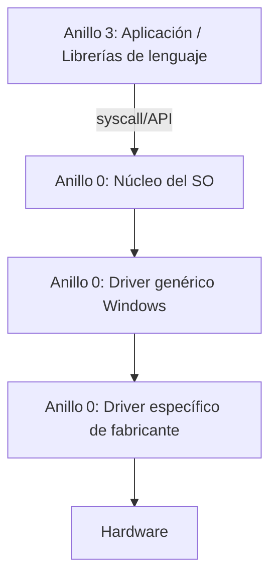

Hardware → Driver Genérico Windows → OS APIs → Aplicaciones
         Driver Específico Fabricante → OS APIs → Aplicaciones
								  OS APIs → Librerías de lenguajes → Aplicaciones

Arquitectura web: Hardware → Drivers → OS APIs → Navegador → Web APIs → Aplicación Web

